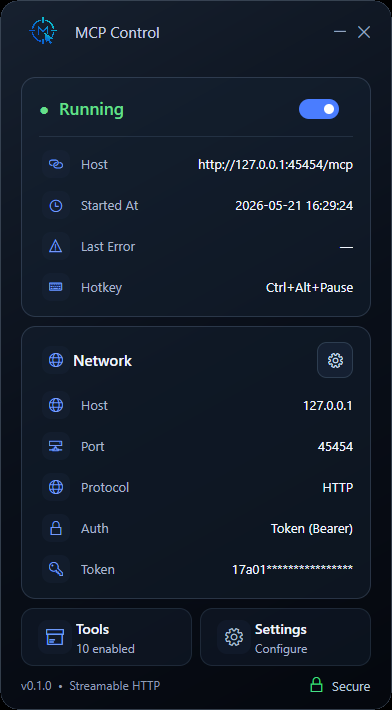

[Русская версия](README.ru.md)

# Desktop MCP Control

A Windows-first MCP control panel that exposes safe, local desktop automation over Streamable HTTP. It gives AI agents a compact glass UI, a tray popup, token authorization, screenshots, mouse and keyboard control, and an emergency stop.



## Highlights

- Compact premium glass control panel for starting, stopping, and monitoring the MCP service.
- Streamable HTTP endpoint at `http://127.0.0.1:45454/mcp` by default.
- Optional `Authorization: Bearer <token>` protection with copy and regenerate actions.
- Dynamic network settings for host, port, and protocol without restarting the app manually.
- Custom tray popup for opening the panel, available tools, settings, and exit.
- Global emergency stop hotkey: `Ctrl+Alt+Pause`.
- Windows desktop automation tools for screenshots, mouse, keyboard, drag-and-drop, and action previews.

## Available tools

| Tool | Access | Description |
| --- | --- | --- |
| `desktop.mouse_move` | write | Move mouse to coordinates. |
| `desktop.mouse_click` | write | Click a mouse button. |
| `desktop.mouse_scroll` | write | Scroll at target coordinates. |
| `desktop.keyboard_type` | write | Type text into the focused window. |
| `desktop.keyboard_hotkey` | write | Press a keyboard shortcut. |
| `desktop.drag_drop` | write | Drag and drop between coordinates. |
| `desktop.capture` | read | Capture display, window, or region screenshots. |
| `desktop.predict_click` | read | Render a screenshot preview of a future click. |
| `desktop.predict_swipe` | read | Render a screenshot preview of a future swipe. |
| `desktop.emergency_stop` | write | Stop queued and future actions until reset. |

## Requirements

- Windows 10 or Windows 11.
- .NET SDK 10.0 or newer for development.
- A Streamable HTTP compatible MCP client.

## Quick start

```powershell
git clone https://github.com/yakoodev/desktop-mcp-control.git
cd desktop-mcp-control
dotnet restore DesktopMcp.slnx
dotnet build DesktopMcp.slnx
dotnet run --project DesktopMcp.App
```

The app starts the MCP runtime automatically and shows the current endpoint in the main window.

## MCP connection

Default endpoint:

```text
http://127.0.0.1:45454/mcp
```

Generic Streamable HTTP client configuration:

```json
{
  "mcpServers": {
    "desktop-mcp-control": {
      "type": "streamable-http",
      "url": "http://127.0.0.1:45454/mcp"
    }
  }
}
```

If token authorization is enabled, add the bearer header:

```json
{
  "headers": {
    "Authorization": "Bearer <token>"
  }
}
```

Client configuration formats vary, so use the equivalent Streamable HTTP URL and header fields in your MCP client.

## Settings

User settings are stored locally in:

```text
%LocalAppData%\desktop-mcp-control\settings.json
```

The settings window controls:

- Host, port, and protocol.
- Authorization mode: no auth or bearer token.
- Token copy, reveal, and regeneration.

Network and authorization changes are applied to the running MCP runtime after saving.

## Safety notes

This app can control your real desktop. Keep the endpoint bound to `127.0.0.1` unless you explicitly need network access. If you bind to `0.0.0.0` or any external interface, enable token authorization and restrict network access at the firewall level.

Use `Ctrl+Alt+Pause` or the `desktop.emergency_stop` tool to stop actions immediately.

## Development

```powershell
dotnet build DesktopMcp.slnx
dotnet test DesktopMcp.slnx
```

Main projects:

- `DesktopMcp.App` - Avalonia UI, tray integration, settings, and view models.
- `DesktopMcp.Mcp` - MCP runtime, authorization, and tool definitions.
- `DesktopMcp.Core` - Windows desktop automation services.
- `DesktopMcp.Tests` - unit tests for runtime, settings, and view model behavior.

## Repository status

This project is pre-1.0 and currently targets Windows desktop automation first. Public API and UI details may change before a stable release.

